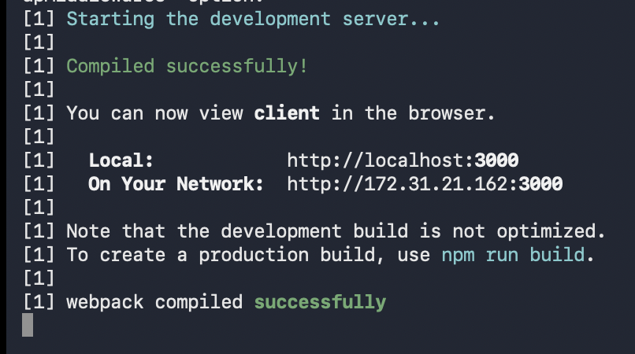
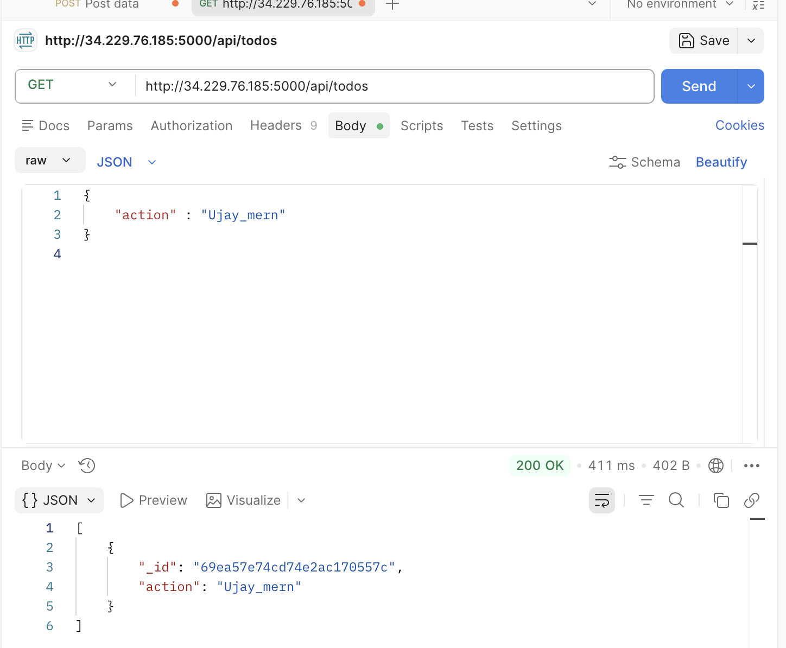

# MERN Stack Todo Application

## Project Overview

This project is a full-stack Todo application built using the MERN stack (MongoDB, Express, React, Node.js). It allows users to create, view, and delete tasks.

---

## Technologies Used

* MongoDB
* Express.js
* React.js
* Node.js

---

## Project Structure

* client/ → React frontend
* server/ → Node/Express backend

---

## Features

* Add a new todo
* View all todos
* Delete a todo
* REST API integration

---

## Screenshots

### Application Running

### Create Todo (POST Request)

### Fetch Todos (GET Request)

---

## How to Run the Project

### Backend

cd server
npm install
npm start

### Frontend

cd client
npm install
npm start

---

## API Example

GET /api/todos
POST /api/todos
DELETE /api/todos/:id

---

## GitHub Repository

https://github.com/ObianujuCarol/MERN-Project

---

